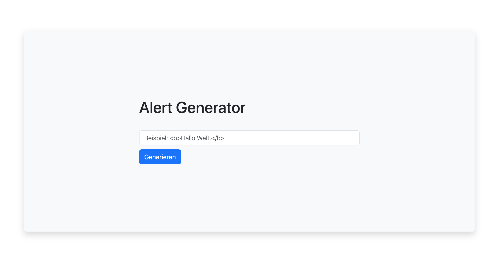

# OOP Alert (Demo)

## Beschreibung

Diese Web-App bietet eine einfache Benutzeroberfläche mit einem Eingabefelder und kann Text, HTML und Arrays/Objekte als ein Modal „lesbar“ ausgeben. Ähnlich wie Entwickler-Konsole.

Im Rahmen meiner Ausbildung zum geprüften Software-Entwickler am WIFI Wien habe ich im Modul **"Programmieren mit JavaScript ‐ Aufbau"** diese Web-App als Übung entwickelt.

## Spezifikation

Der code ist objektorientiert aufgebaut und folgt einem sinnvollen Klassenkonzept mit Attributen, Methoden und einer klaren Strukturierung.

## Funktionen

**Einfache Benutzeroberfläche**:
Die Web-App bietet eine benutzerfreundliche Oberfläche mit einem klaren Eingabefeld und einem Modal für die Ausgabe von Daten.

**User-Error-Handling**:
Fehlermeldungen werden im Benutzerinterface angezeigt, um den Benutzer über fehlerhafte Eingaben oder andere Probleme zu informieren.

**Typüberprüfung**:
Die App überprüft automatisch den Typ der eingegebenen Daten und zeigt sie im Ausgabemodal entsprechend an.

**Animierter Placeholder**:
Um die Benutzererfahrung zu verbessern, verwendet die Web-App einen animierten Placeholder im Eingabefeld, der dem Benutzer visuelles Feedback gibt.

## Technologien

HTML, CSS, Bootstrap, JavaScript

## Ausgabe
